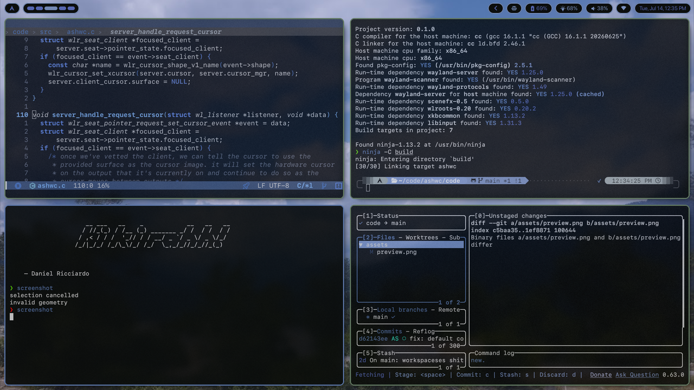
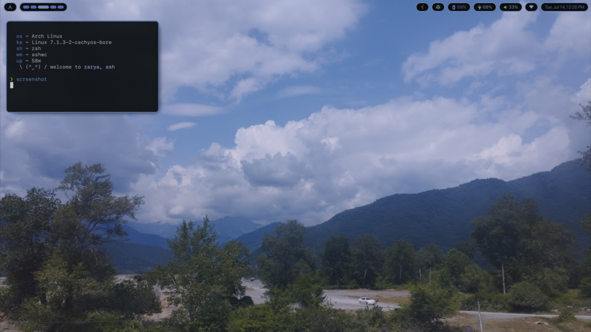
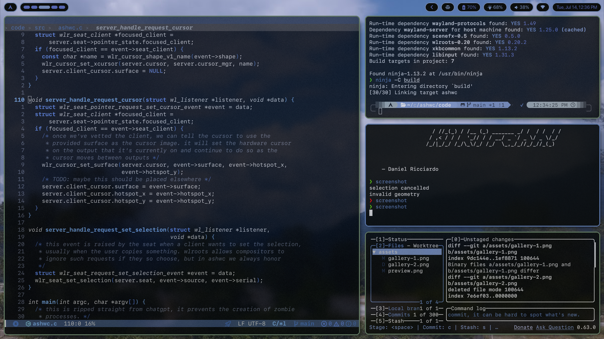

<div align="center">
  <h1>ashwc</h1>
  
  <br>
</div>
<br>

## about
`ashwc` came to existence out of pure will to create a compositor tailored to my taste and needs. the whole point of `ashwc` is to be as simple and predictable to use and not get in the way of its user with any confusing behaviour.

all the features implemented up to this point (and all that will be implemented it the future) are done in the simplest possible way i could think off, and all the features requested are added only if they provide something to the end user while maintaining the current simplicity of the compositor.

although `ashwc` is aiming to be really simple in its behaviour, it does provide a lot of (opt-in) features to improve its looks such as animations, transparency, rounded corners, blur etc. these are here for all the users who like thinkering with their setup and can be disabled completely, or used in any capacity.

## features
- tiling and floating toplevels
- master layout with support for multiple masters, ideal for wide monitors
- keyboard focused workflow
- great multitasking with multimonitor and workspaces support
- smooth and customizable animations
- easy configuration with hot reloading on save
- eye-candy (opacity, blur, rounded corners and shadows)
- portals and an ipc for integrating with other apps

## dependencies
- meson *
- ninja *
- wayland-protocols *
- wayland
- libinput
- libdrm
- pixman
- libxkbcommon
- wlroots 19.0 
- scenefx 0.4

> \* compile-time dependencies

## building
```bash
git clone https://github.com/shadowash8/ashwc
cd ashwc
meson setup build
ninja -C build
```

## installation

```bash
git clone https://github.com/shadowash8/ashwc
cd ashwc
meson setup build --prefix=/usr/local --buildtype=release
ninja -C build install
```

## post install
if you need to interact with sandboxed applications and/or screenshare you will need xdg-desktop-portals. by default `ashwc` needs
- xdg-desktop-portal (base)
- xdg-desktop-portal-wlr (for screensharing)
- xdg-desktop-portal-gtk (for everything else)

## usage
```bash
ashwc [--debug]
```

> you probably want to run it from a tty

## configuration
configuration is done in a configuration file found at `$XDG_CONFIG_HOME/ashwc/ashwc.conf` or `$HOME/.config/ashwc/ashwc.conf`. if no config is found a default config will be used (you need `ashwc` installed, see above).

> note: you can use other configuration location by setting `ASHWC_CONFIG_PATH` before running `ashwc`.

for detailed documentation see `examples/example.conf`. you can also find the default config in the repo.

## gallery
<div align="center">


</div>

## acknowledgement
`ashwc` is a fork of the amazing [mwc](https://github.com/nikoloc/mwc) made by [nikoloc](https://github.com/nikoloc)
